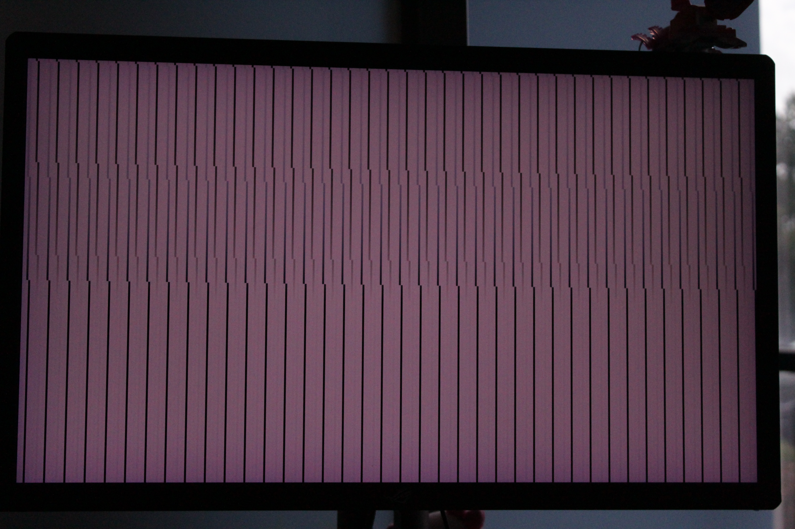

## Summary

When direct driving a display (VK_EXT_display), the "FIFO latest ready" present mode displays tearing, contrary to [the Vulkan specification](https://docs.vulkan.org/spec/latest/chapters/VK_KHR_surface/wsi.html#VkPresentModeKHR):
> VK_PRESENT_MODE_FIFO_LATEST_READY_KHR specifies that the presentation engine waits for the next vertical blanking period to update the current image. Tearing **cannot** be observed. ...

Regular FIFO presentation does not show tearing.

## Machine

OS: Windows 11 Pro for Workstations, version 10.0.26200 Build 26200

Hardware:
- NVIDIA RTX A4500 connected to Dell P2715Q (4k 60Hz)
- NVIDIA RTX 45000 Ada Generation connected to ROG XG27UQR (4k 144Hz)

Drivers tested:
- 597.06 (latest studio)
- 597.11 (latest Vulkan beta)
- 616.92 (latest new feature)

## App description

main.cpp is a self-contained application for reproducing this issue. (Disclaimer: this file is mostly AI-generated based on my description of what API calls should be necessary to reproduce the issue I was seeing in a larger application.) The file can be compiled against the base Vulkan SDK and does not link against any dependencies other than the Vulkan loader. The compiled executable should be run from the same folder as the .spv files (which were originally compiled from their corresponding GLSL files.) When run, the application prompts the user to select a physical device, display, and present mode. A swapchain with 5 images is created to allow multiple images to accumulate per display refresh. Each rendered frame contains vertical bars moving to the right. Since this takes basically no time to render, the main loop waits for at least `1 / (5 * refreshRate)` between frames so they don't all pile up right after a display refresh.

## Test results

In my testing, there were always only two present modes available: VK_PRESENT_MODE_FIFO_KHR and VK_PRESENT_MODE_FIFO_LATEST_READY_KHR. The former never showed tearing, while the latter showed severe tearing. Results were identical across all combinations of drivers and displays mentioned previously. I set up a camera with a very fast exposure time to capture the result. Some ghosting is visible due to the monitor being partway through refreshing, but it is evident that in one case the monitor is transitioning between two torn images, and in the other case it is transitioning between two smooth images.

### Result with VK_PRESENT_MODE_FIFO_LATEST_READY_KHR

### Result with VK_PRESENT_MODE_FIFO_KHR

